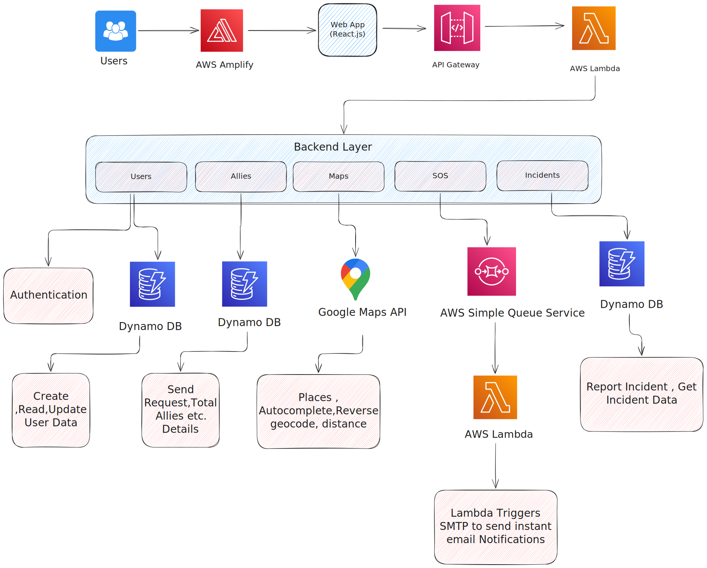

# 🛡️ GuardianX – Safety API Platform

**Tagline**: *Built for safety. Designed for freedom.*

GuardianX is a secure, scalable backend system built with **FastAPI**, designed to power a real-time personal safety app. It supports **OTP-based authentication**, **user registration**, **real-time SOS tracking**, **incident reporting**, and **ally-based location tracking**. The backend integrates **Redis caching** and **Redis-based circuit breakers** for high availability and low latency. The system is deployed serverlessly on **AWS Lambda** using **Docker images stored in ECR**, triggered via **API Gateway**, and managed using **Terraform**.

---

## 🕐️ Architecture

**Core Stack:**

* **Backend**: FastAPI (ASGI)
* **Deployment**: AWS Lambda + API Gateway
* **Container**: AWS ECR (Docker)
* **Infrastructure as Code**: Terraform
* **Database**: DynamoDB (users, sos_events, incidents, otp_requests)
* **Cache & Circuit Breaker**: Redis Cloud
* **Email**: SMTP (Gmail)
* **Auth**: JWT + Refresh Tokens
* **Geolocation**: Google Maps API (proxied)
* **Monitoring**: CloudWatch + SNS Alerts

**Flow:**

1. User signs up → backend stores profile in DynamoDB
2. User requests OTP → email OTP sent via Gmail SMTP
3. OTP verified → JWT + refresh token issued
4. User triggers SOS → location + timestamp stored in `sos_events`
5. Allies receive email alerts and can track real-time location
6. Redis caching speeds up repeated GET requests
7. Redis circuit breakers prevent cascading failures from unhealthy services
8. Optional: location heartbeat + incident reporting

---

## 🖼️ Architecture Diagram

### 🧱 Layered System Design (Infrastructure + Functional Flow)

**SVG Version (for zoomable detail):**



---

## 🚀 How to Clone and Run Locally

```bash
git clone https://github.com/anishsamantaray/GuardianX-backend.git
cd guardianx-backend
python -m venv venv
source venv/bin/activate  # or venv\Scripts\activate
pip install -r requirements.txt
```

### 🥚 Run with Uvicorn

```bash
uvicorn app.main:app --reload
```

---

## 🔐 Required Environment Variables

Create a `.env` file:

```env
# AWS
AWS_REGION=ap-south-1
AWS_ACCESS_KEY_ID=your_key
AWS_SECRET_ACCESS_KEY=your_secret

# SMTP
SMTP_USER=your_email@gmail.com
SMTP_PASS=your_app_password

# JWT
JWT_SECRET_KEY=supersecurekey
JWT_ALGORITHM=HS256
JWT_ACCESS_EXPIRE_MINUTES=30
JWT_REFRESH_EXPIRE_MINUTES=10080

# Redis
REDIS_HOST=your_redis_host
REDIS_PORT=your_redis_port
REDIS_PASSWORD=your_redis_password

# Google Maps
GOOGLE_MAPS_API_KEY=your_maps_key
```

---

## 🐳 Docker + ECR + Lambda Deployment

### 1. Build Docker Image

```bash
docker build -t guardianx-fastapi .
```

### 2. Push to ECR

```bash
aws ecr get-login-password | docker login --username AWS --password-stdin <ecr-url>
docker tag guardianx-fastapi:latest <ecr-url>/guardianx-fastapi:latest
docker push <ecr-url>/guardianx-fastapi:latest
```

### 3. Deploy Using Terraform

```bash
cd terraform
terraform init
terraform apply -auto-approve
```

### 4. API Gateway Endpoint

Terraform will output the live HTTP endpoint linked to Lambda.

---

## 📦 DynamoDB Tables

| Table          | Partition Key | Sort Key  | Purpose                |
| -------------- | ------------- | --------- | ---------------------- |
| `users`        | email         | –         | User registration info |
| `otp_requests` | email         | –         | OTP storage + TTL      |
| `sos_events`   | email         | timestamp | SOS trigger logs       |
| `incidents`    | incident_id   | –         | Reported incidents     |

---

## 📙 API Endpoints Overview

| Method | Endpoint                  | Description                     |
| ------ | ------------------------- | ------------------------------- |
| POST   | /user/signup              | Create new user                 |
| POST   | /user/send-otp            | Send OTP to registered user     |
| POST   | /user/verify-otp          | Validate OTP, return tokens     |
| POST   | /user/refresh-token       | Get new access token            |
| GET    | /user/me                  | Fetch current user profile      |
| PUT    | /user/edit                | Update user profile             |
| POST   | /sos/trigger              | Log SOS event                   |
| POST   | /sos/heartbeat            | Update live location            |
| GET    | /sos/track/{email}        | Track live SOS location of user |
| POST   | /incident/report          | Submit past safety report       |
| GET    | /incident/history/{email} | View user's incident history    |
| GET    | /incident/{incident_id}   | Get specific incident details   |
| GET    | /maps/autocomplete        | Proxy for address typing        |
| GET    | /maps/details             | Get full address from ID        |
| GET    | /maps/distance-from-home  | Distance from home via road     |

---

## 📌 Redis Integration

**Caching Layer**

* Write-through caching for user and incident reads
* TTL-based invalidation (5–10 min)
* Reduces DynamoDB read load and improves response latency

**Circuit Breakers**

* Implemented using Redis keys with TTL
* Prevents repetitive retries to failing APIs
* State machine: `closed → open → half-open`
* Auto resets after cooldown period

---

## 🔖 Roadmap (Next Features)

* [ ] Push notifications (SNS)
* [ ] Admin dashboard (React + Map integration)
* [ ] Ally system with mutual request & live tracking
* [ ] Zone-based geofencing and risk prediction
* [ ] Upload media (image/audio) for incidents
* [ ] Chatbot integration (LLM-powered)
* [ ] Redis Pub/Sub for live updates
* [ ] Mobile App using React Native

---

## 🧠 Credits

Built by **Anish Samantaray** using FastAPI, AWS Lambda, DynamoDB, and Redis for GuardianX – a modern safety and incident reporting platform.

---

## 🔖 License

MIT – Free to use, modify, and deploy.
